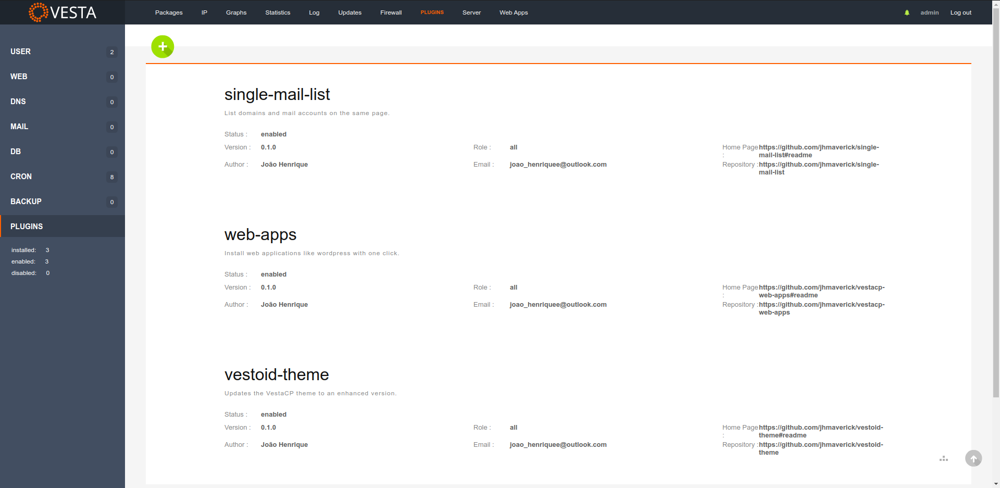

# VestaCP Plugin Manager

This script adds to vesta the ability to work with plugins.\
The plugins will be installed by Github repository or zip files.

Plugin manager features:
* Allows plugins to add executables to the Vesta bin directory.
* Change the VestaCP web files by adding actions and filters such as wordpress to allow plugins to interact.
  * The default menu will be hidden, and the menus will be added by the "header_menu" filter to allow plugins to add and edit items.
  * If the plugin "vestoid-theme" is installed, l-stats will be moved to the left and new options can be added with the "menu" filter.
  * Other actions will be added other points of the layout.
  * Adds the classes "Vesta" and "VestaPlugin" to assist plugins in their execution.
* Plugins can have hooks to run during their life cycle.


## Installation

Dependencies:

* jq library to manipulate JSON by bash
  * Debian: `sudo apt-get -y install jq`
  * CentOS: `sudo yum -y install jq`

```bash
curl -sL https://raw.githubusercontent.com/jhmaverick/vestacp-plugin-manager/master/install.sh | bash -
```

The installer will not replace the default vesta web directory, it will apply the necessary parts using regular expressions.\
Before starting, the script will backup the web directory to "/backup".

Files to be changed:
* /usr/local/vesta/web/inc/main.php
* /usr/local/vesta/web/templates/header.html
* /usr/local/vesta/web/templates/admin/panel.html
* /usr/local/vesta/web/templates/user/panel.html
* /usr/local/vesta/web/templates/admin/list_server_info.html
* /usr/local/vesta/web/templates/footer.html

You can see the changes that will be made in: `reconfigure-vesta-web.sh`.\
This script can also be executed if any vesta update removes the changes.

To remove the changes and delete the plugin manager, run `/usr/local/vesta/plugin-manager/uninstall.sh`



You can see information about creating plugins on the [project wiki](https://github.com/jhmaverick/vestacp-plugin-manager/wiki).


